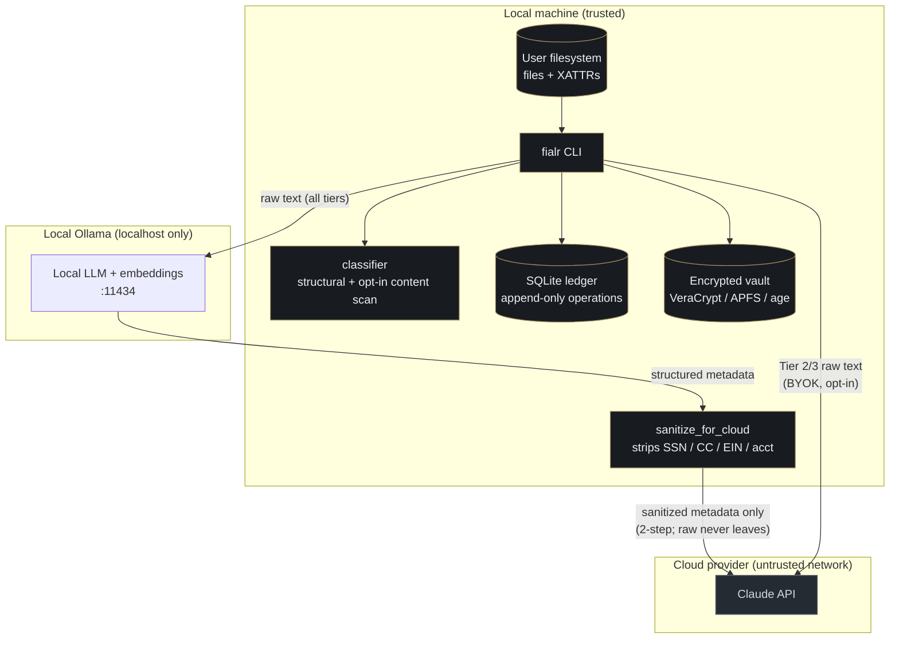

# Architecture

This page describes how fialr is organized: the module map, how work is executed as
auditable jobs, the SQLite and XATTR data model, the sensitivity tiers, and the
enrichment pipeline including its two-step sanitization path.

## Hard constraints

These are non-negotiable and shape every part of the system.

1. **Tier 1 cloud requires two-step confirmation.** All tiers are enriched by local
   AI (Ollama) by default. Tier 1 (RESTRICTED) files can use cloud AI only when both
   a config flag (`allow_tier1_cloud = true`) and a CLI flag (`--allow-tier1`) are
   active. Tier 2 and Tier 3 files default to local Ollama but support opt-in cloud
   providers.
2. **Content hash as identity.** The BLAKE3 hash of file content is the stable
   identifier. Filenames and paths are mutable metadata.
3. **SQLite as source of truth.** The SQLite database is authoritative for all
   metadata and audit history on every platform. XATTRs are a derived cache layer,
   rebuilt from SQLite, not the reverse.
4. **Safety by default.** Every module has dry-run mode on by default. Execution
   requires an explicit flag or confirmation.
5. **No platform checks in core.** Core modules import a platform adapter at runtime
   rather than branching on the operating system.

## Module map overview

The codebase is organized by responsibility. Source is not distributed publicly; the
map below summarizes the structure documented in the project's internal architecture.

| Area | Responsibility |
|------|----------------|
| `cli` | Unified CLI entry point and custom help rendering. |
| `core/inventory` | Filesystem traversal and manifest generation. |
| `core/classifier` | Sensitivity tiering and category suggestion. |
| `core/planner` | Dry-run move-plan generation. |
| `core/executor` | Execution of an approved plan with pre/post hash verification. |
| `core/deduplicate` | Hash-based and near-duplicate detection. |
| `core/rename` | Template-driven naming engine. |
| `core/organize` | Schema-driven reorganization. |
| `core/validate` | Integrity verification against manifests. |
| `core/undo` | Rollback of moves, renames, and archives. |
| `core/vault` | Encrypted vault (VeraCrypt, APFS, age). |
| `core/embeddings` | Vector embeddings, cosine similarity, semantic search. |
| `core/search` | Full-text (FTS5) search plus AI query expansion and semantic search. |
| `core/license` | License activation and feature gating. |
| `enrichment/inference` | Provider interface (Ollama default, cloud opt-in). |
| `enrichment/extractor` | Text extraction: OCR, PDF, EXIF, audio, Office. |
| `enrichment/enrich` | Enrichment orchestrator and tier gating. |
| `metadata/db` | SQLite operations and schema. |
| `metadata/xattr` | Platform-aware extended attribute read/write. |
| `metadata/export` | On-demand sidecar export (JSON, Markdown, YAML, CSV). |
| `platform/` | Platform adapters (`base`, `macos`, `linux`); selected at runtime. |
| `tui/` | Textual interactive shell (the `tui` command). |
| `utils/` | Hashing (BLAKE3 primary, SHA256 secondary), config, logging, output. |

Cross-platform behavior is handled by adapters. Core modules receive the correct
adapter at runtime; there are no operating-system branches in core. Where a
capability is unavailable on a platform (for example XATTRs on FAT32, exFAT, or
network mounts), the operation degrades to SQLite-only and the skip is logged. No
error is raised and no functionality is lost.

## Job execution model

Every operation is a named job. Jobs are the unit of execution, auditing, and
resumability. A job directory captures the full state needed to review, run, and
resume the work.

A job records a pre-execution snapshot, the proposed operations in both
human-reviewable and machine forms, an append-only operation log, a human-readable
report, and a checkpoint for resume.

**Lifecycle:** Init → Plan → Validate → Execute → Verify → Report.

- Every operation is logged before and after execution.
- A checkpoint is written after every N files (configurable).
- Interrupted jobs are resumable from the last checkpoint.
- Execution refuses to run until a plan is marked reviewed; dry-run is the default.

## Data model: SQLite and XATTRs

SQLite is the source of truth. XATTRs are a derived cache for fast per-file lookups
where the filesystem supports them.

### SQLite tables

| Table | Purpose |
|-------|---------|
| `files` | Canonical record per unique file, keyed by BLAKE3 content hash. |
| `paths` | All current and historical paths for a hash. |
| `operations` | Append-only audit ledger. Non-rebuildable. |
| `jobs` | Job metadata and config snapshots. |
| `duplicates` | Duplicate groups with canonical selection. |
| `review_queue` | Files pending human review. |
| `vault_entries` | Files archived in encrypted vaults. |
| `embeddings` | Vector embeddings for semantic search, keyed by hash and model. |
| `search_index` | FTS5 virtual table over enrichment metadata. |
| `schema_meta` | Schema migration history. |

The `operations` ledger is treated as sacred: append-only and non-rebuildable. Every
file operation hashes before, executes, hashes after, and logs both.

### XATTR keys

Extended attributes mirror a subset of the metadata for fast filesystem-level
access. Keys are namespaced per platform (`com.fialr.*` on macOS, `user.fialr.*` on
Linux). The cached attributes are: `hash`, `hash_sha256`, `sensitivity`, `category`,
`entity`, `tags`, `date`, `descriptor`, `reviewed`, `original_name`,
`original_path`, `job_uuid`, `enriched_at`, and `exclude`.

**Degradation policy.** When XATTRs are unsupported, fialr writes to SQLite only and
logs the skip. No error is raised.

## Sensitivity tiers

Classification assigns each file a tier. The tier governs how the file may be
enriched and how operations on it are gated.

| Tier | Label | AI access | Operations |
|------|-------|-----------|------------|
| 1 | RESTRICTED | Local AI (Ollama). Cloud requires two-step confirmation. | Routed to the review queue before any operation. Encrypted vault. |
| 2 | SENSITIVE | Local LLM by default. Cloud opt-in via a configured provider. | Move and rename with human confirmation. |
| 3 | INTERNAL | Full enrichment via the configured provider (local or cloud). | Automated above the confidence threshold. |

Classification is structural by default, with an opt-in local content scan
(`[sensitivity] content_scan = true`) that detects signals such as SSNs,
Luhn-valid credit-card numbers, and email/password proximity. The content scan runs
locally only.

## Enrichment pipeline

Enrichment extracts text from a file, runs inference to produce structured metadata,
and routes the result either to auto-apply (above the confidence threshold) or to the
review queue (below it). Tier 1 results from a local provider are always routed to
review regardless of confidence.

- **Text extraction:** OCR for scanned PDFs (ocrmypdf + Tesseract), native PDF text
  (pypdfium2), EXIF for photos (piexif), audio tags (mutagen), and Office documents
  (python-docx, openpyxl).
- **Inference:** local Ollama on `localhost` by default; the endpoint is validated to
  be local. Cloud providers (Claude API via bring-your-own-key) and a two-step
  provider are available behind configuration.
- **Output:** structured JSON — filename tokens (date, entity, descriptor), semantic
  tags, a one-sentence summary, and a confidence score.
- **Embeddings:** when enabled and Ollama is available, embeddings are computed
  during enrichment. Embedding is best-effort and never blocks enrichment, and it is
  skipped in dry-run mode.

### Two-step sanitization

When the two-step provider is configured, or the `--cloud-refine` flag is used, cloud
refinement happens without sending raw file content off the machine:

1. **Local extraction.** Ollama processes the raw file text locally.
2. **Sanitization.** The local inference output is passed through a sanitizer that
   strips SSNs, credit-card numbers, bank account and routing numbers, and EINs. It
   preserves names, institutions, record types (1099, W-2), dates, and tags — these
   are needed for naming and are not identifiers.
3. **Cloud refinement.** Only the sanitized metadata — never raw text — is sent to the
   cloud provider for quality improvement.

Tier gating for the two-step path: Tier 3 is automatic, Tier 2 is opt-in via
`--cloud-refine`, and Tier 1 falls back to local-only unless the two-step cloud
confirmation (config flag plus CLI flag) is active.

## Trust boundaries and data flow

The local machine is trusted. Raw user content is permitted to cross only one
boundary — to local Ollama, which is validated to be `localhost` only — except where a
user has explicitly opted into cloud enrichment. In the two-step path, only sanitized
metadata leaves the machine; raw file content never does.

For the full trust-boundary analysis — including the license server, supply chain,
vault, and secrets handling — see the [Security](security.md) page.
